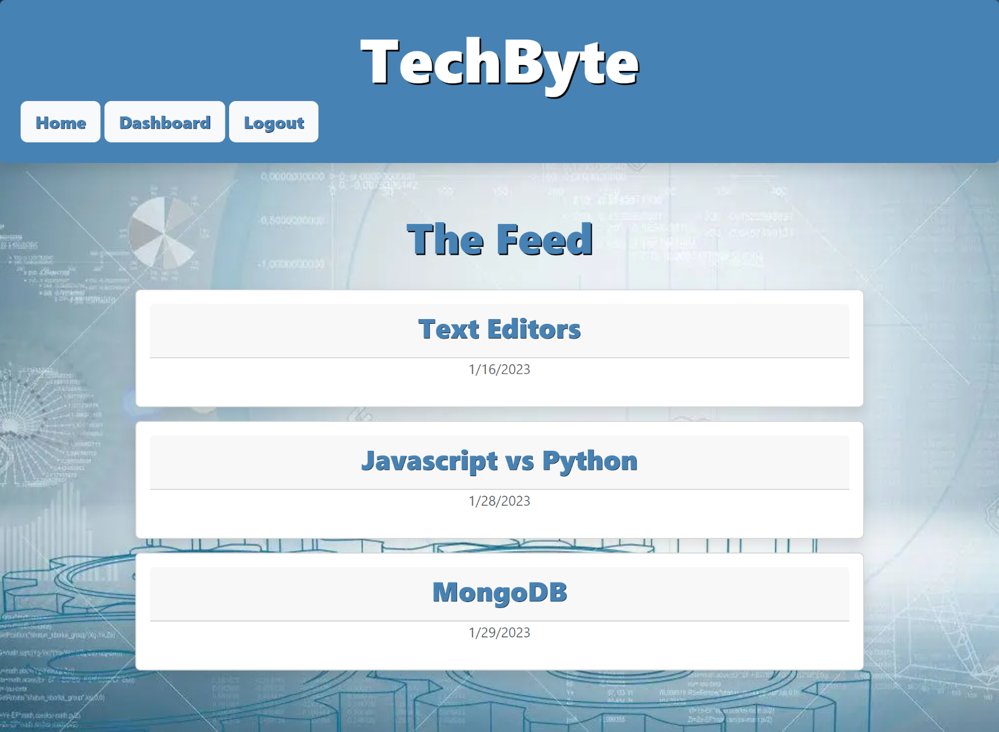

# TechByte-MVC

## Motivation

The motivation for this project is to provide developers with a convenient and efficient way to read, learn or write about technical concepts, recent advancements, and new technologies. The user will be able to create an account where they can share their blogs as well as comment on other developer's posts. This application will follow the MVC paradigm in its structure.

In completing this project, I have learned the basic concepts of MySQL, Sequelize, and Express-Handlebars.js. I have also learned the benefits of utilizing modular routes to maintain cleaner code.

### Deployed Link

- https://techbyte.herokuapp.com/

## Tools Utilized

   
  

## Table of Contents

- [Motivation](#motivation)

- [Tools-Utilized](#Tools-Utilized)

- [Installation](#installation)

- [Usage](#usage)

- [License](#license)

- [Contribution](#contribution)

- [Challenges](#challenges)

- [Questions](#questions)

## Installation

User just requires access to a web browser.

## Usage

As a user, you will be prompted to either login or sign up in order to view or post tech blogs. Developers will be able to read or write about technical concepts, recent advancements, and new technologies.

## License

  
This application is under the MIT

### Resources of significance:

 

Special thanks to [Ileriayo Adebiyi](https://github.com/Ileriayo/markdown-badges#testing) for his public library of common badges!

## Questions

Any concerns or questions, please contact me
 

[Cherie Walker](https://github.com/Cherie2)